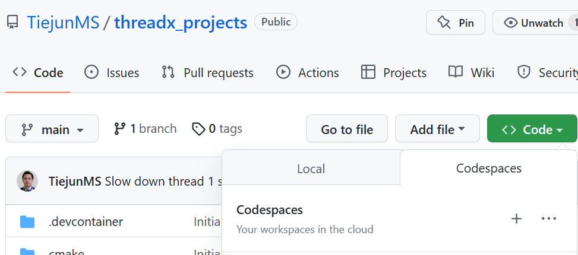
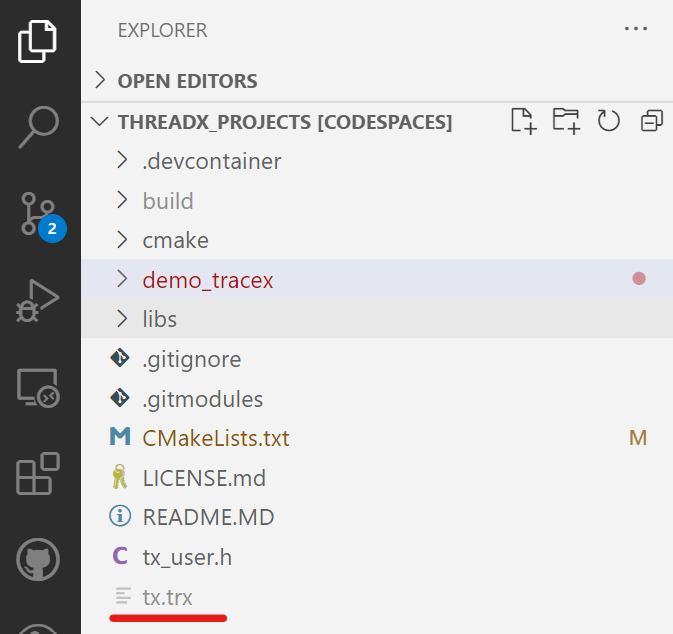

# About this project
This demo is based on [ThreadX demo for Linux](https://github.com/azure-rtos/threadx/blob/master/ports/linux/gnu/example_build/sample_threadx.c). In this demo, [TraceX](https://learn.microsoft.com/en-us/azure/rtos/tracex/overview-tracex) is enabled. Trace [buffer](https://learn.microsoft.com/en-us/azure/rtos/tracex/chapter5) is generated and dumped to file for easy to use. You will need to install [TraceX](https://learn.microsoft.com/en-us/azure/rtos/tracex/chapter2) to open the buffer.

## How to run
1. Open the project in codespace from root path.
  
1. Open a terminal and build the project. Make sure the path is at the root of this repository.
  ```
  cmake -GNinja -Bbuild
  cmake --build build
  ```
1. Run this demo.
  ```
  ./build/demo_tracex/demo_tracex ./tx.trx
  ```
1. Let the demo run for 3 seconds or more to generate enough events.
1. Terminate the application by press `CTRL+C`.
1. Download *./tx.trx* from **Explorer** tab.
	
1. In your local disk, double click *tx.trx* to open it in TraceX.
